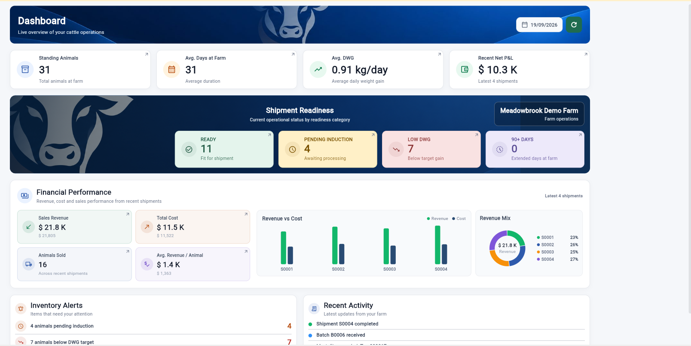
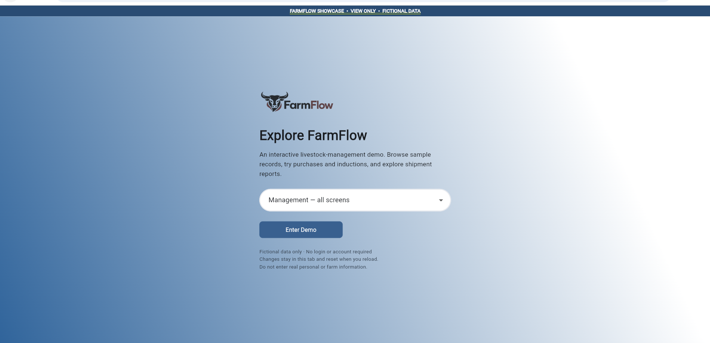

# FarmFlow — Cattle Farm Management

**From purchase to shipment: one operational view of cattle inventory, weight performance, and farm finances.**

FarmFlow is a cattle-farm operations application covering purchase batches and animal intake, induction, live inventory, shipment/mortality recording, and management reporting. The full V1 uses a Flutter interface with Supabase authentication and PostgreSQL business operations. This repository presents a **separate, view-only Flutter Web showcase** using fictional sample records and USD ($) figures.



> **PUBLIC SHOWCASE — VIEW ONLY.** Visitors can browse the fictional dataset, inspect dashboards, and use supported searches and filters. Purchase, induction, shipment, correction, delete, and reset submissions are disabled. The static site has **no production Supabase connection** and cannot change live farm records. Some shipment-page search behavior is a known showcase limitation.

## Explore the showcase

**[Open the live FarmFlow Showcase](https://farm-flow-wheat.vercel.app/)**

Select a demonstration role to explore the corresponding view; no real account is required. The manager view exposes the full showcase navigation. The browser application uses fictional market and supplier names, animal records, and shipment figures; money is displayed in USD. The data shown is illustrative, not a production benchmark.



## Features

| Area | What it shows | Public showcase |
| --- | --- | --- |
| Dashboard | Standing inventory, average days at farm, daily weight gain (DWG), shipment readiness, financial performance, alerts, recent activity | Browse |
| Purchase / Animal Intake | Batch and animal purchase information, suppliers, markets, breeds, weights and rates | View only; no saving |
| Induction | Induction information and pending animals | View only; no saving/corrections |
| Live Inventory | Animal tags, batches, weights, farm days, DWG and status | Browse, search and filter |
| Animal Out | Shipment and mortality workflows | View only; no transactions |
| Reports / Shipment P&L | Operational and financial summaries based on fictional records | Browse; shipment search has a known limitation |
| Profile / Roles | Fictional farm details and management, purchase and induction views | No real authentication or profile editing |

### Operational flow in the full application

```text
Purchase batch / animal intake
           ↓
Canonical tag validation → induction
           ↓
Live inventory and performance monitoring
           ↓
Shipment or mortality
           ↓
Reports, shipment P&L and management dashboard
```

The full V1 uses database constraints and transactional functions for persistent integrity; the static showcase **does not implement these live transactions**.

## Technology and architecture

| Layer | Full FarmFlow V1 | Public showcase |
| --- | --- | --- |
| UI | Flutter Web | Compiled Flutter Web |
| Data / auth | Supabase Auth and PostgreSQL | Fictional packaged data, no backend |
| Integrity | Constraints, RLS and transactional RPCs | Read-only UI and data-store restrictions |
| Windows delivery | .NET Framework loopback launcher and bundled web assets | Not distributed by this repository |
| Hosting | Browser or portable Windows package | GitHub source for static Vercel hosting |

See the [architecture overview](docs/architecture/OVERVIEW.md) and [architecture decision records](docs/ADR/).

## Repository contents

```text
index.html, main.dart.js, assets/, canvaskit/, icons/  # Published static website
docs/screenshots/                                      # Showcase screenshots
docs/ADR/                                             # Architecture decision records
docs/architecture/                                    # System and process architecture
backend/FarmFlow_V1/                                  # Full V1 backend reference bundle
README.md
```

**Publication boundary:** This is not the complete production Flutter source repository. The SQL in [`backend/FarmFlow_V1/`](backend/FarmFlow_V1/) documents the full V1 architecture; **it is not used by the public website**. Its [installation notes](backend/FarmFlow_V1/README_SQL_ORDER.md) concern a *new, empty* deliberately configured environment. **Never run the bundle against a live production farm database.** Independent installation and security review are necessary before reusing it.

## Architecture decisions

- [ADR 001 — Flutter Web UI](docs/ADR/001-flutter-ui.md)
- [ADR 002 — Supabase PostgreSQL and integrity](docs/ADR/002-supabase-backend.md)
- [ADR 003 — Portable Windows launcher](docs/ADR/003-windows-launcher.md)
- [ADR 004 — Isolated view-only showcase](docs/ADR/004-static-showcase.md)
- [Authoritative V1 backend object map](backend/FarmFlow_V1/BACKEND_AUTHORITATIVE_MAP.md)

## Deployment status

The FarmFlow Showcase is deployed on Vercel: **[Open the live demo](https://farm-flow-wheat.vercel.app/)**. The deployment uses the repository root (`.`) as its output directory, with no Flutter build step on Vercel.
Local showcase testing: the Flutter test suite passed, the release web build completed, and the dashboard, navigation, read-only controls, and most searches were reviewed in Chrome. This does **not** establish deployment success or full V1 backend integration-test coverage.

## Data, privacy and limitations

- All showcase data is fictional, with USD display; it is not linked to real farms, clients, or operational accounts.
- No production credentials or production Supabase project configuration are needed to run the static showcase.
- Write controls and backing write operations are disabled. This is a portfolio demonstration, not a transaction-ready shared demo environment.
- Shipment-page search has a known limitation; no claim of functional parity with the production app is made.

**License:** No open-source license is granted by this repository at present. Do not assume the full FarmFlow production application or its assets are licensed for reuse.
